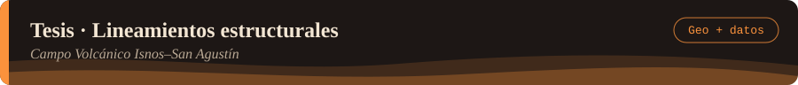
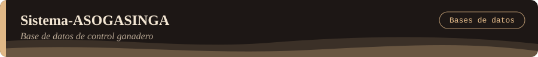
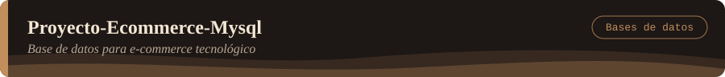
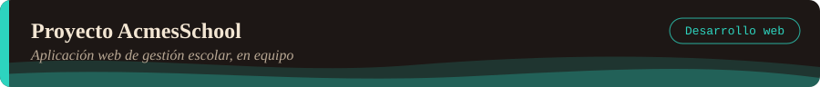
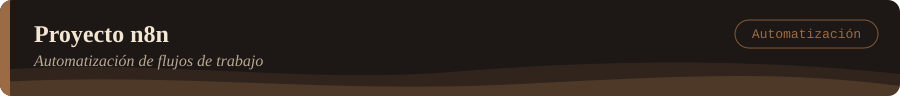
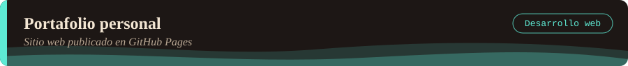

## Quién soy

Soy **geóloga** (Universidad Industrial de Santander) y **desarrolladora junior en formación** (Técnica en Desarrollo de Software, Campuslands). Mi base sólida está en desarrollo web, Python y bases de datos relacionales, y busco un equipo donde pueda seguir creciendo y aportar valor desde el primer día.

**Donde se cruzan la tierra y el código**

| En geología aprendí a… | En desarrollo lo aplico para… |
|---|---|
| Leer capas y entender cómo se construye un sistema de abajo hacia arriba | Diseñar bases de datos y aplicaciones por capas, con estructura clara |
| Trabajar con datos de campo incompletos y validarlos | Escribir validaciones y consultas que protegen la integridad de la información |
| Procesar datos geoespaciales con SIG y estadística | Automatizar análisis con Python y dejar resultados reproducibles |
| Ser rigurosa con la evidencia antes de sacar conclusiones | Probar, depurar y documentar antes de dar algo por terminado |

- 🌋 Tesis en análisis morfométrico aplicando Python y SIG
- 📊 Trabajo con **Scrum**: sprints, equipo e iteración continua
- 🗣️ Español (nativo) · Inglés (intermedio B1, en progreso)
- 📍 Bucaramanga, Colombia

## Tech stack

## Proyectos destacados

<!-- Cada proyecto = imagen de cabecera (SVG) + tabla con Objetivo, Aporte, Tecnologías y Repositorio -->

| | |
|---|---|
| 🎯 **Objetivo** | Caracterizar las estructuras volcánicas del campo volcánico monogenético Isnos–San Agustín (Huila) mediante análisis morfométrico y morfoestructural. |
| 💪 **Aporte** | Automaticé el procesamiento y análisis estadístico de datos geoespaciales con Python, integrando SIG para generar resultados reproducibles de investigación científica. |
| 🧰 **Tecnologías** | `Python` `Jupyter Notebook` `Análisis de datos` `ArcGIS` `QGIS` |
| 🔗 **Repositorio** |  |

 

| | |
|---|---|
| 🎯 **Objetivo** | Implementar una base de datos relacional para el control ganadero de ASOGASINGA, centralizando la información del hato y sus operaciones. |
| 💪 **Aporte** | Diseñé e implementé procedimientos almacenados, funciones, triggers y eventos, junto con gestión de seguridad basada en roles para proteger la información. |
| 🧰 **Tecnologías** | `MySQL` `SQL` `Modelado relacional` `Seguridad por roles` |
| 🔗 **Repositorio** |  |

 

| | |
|---|---|
| 🎯 **Objetivo** | Diseñar el modelo relacional e implementar la base de datos central de un e-commerce tecnológico, garantizando la integridad de las operaciones de venta. |
| 💪 **Aporte** | Construí el modelo con restricciones de negocio avanzadas y consultas de analítica de datos para apoyar la toma de decisiones comerciales. |
| 🧰 **Tecnologías** | `MySQL` `SQL` `Diseño de modelo relacional` `Analítica de datos` |
| 🔗 **Repositorio** |  |

 

| | |
|---|---|
| 🎯 **Objetivo** | Desarrollar una aplicación web para la gestión escolar, con lógica de interacción y validaciones en el navegador. |
| 💪 **Aporte** | Trabajé en equipo bajo **Scrum**, participando en la planificación por sprints, el desarrollo de interfaces y la lógica de validación del lado del cliente. |
| 🧰 **Tecnologías** | `JavaScript` `HTML5` `CSS3` `Scrum` `Git` `GitHub` |
| 🔗 **Repositorio** |  |

 

| | |
|---|---|
| 🎯 **Objetivo** | Diseñar un flujo de automatización que integre servicios externos y procese datos sin intervención manual. |
| 💪 **Aporte** | Construí un workflow funcional en n8n conectando APIs y servicios externos, aplicando lógica estructurada para el procesamiento automatizado de datos. |
| 🧰 **Tecnologías** | `n8n` `Automatización` `Integración de APIs` |
| 🔗 **Repositorio** |  |

 

| | |
|---|---|
| 🎯 **Objetivo** | Crear mi portafolio web personal para presentar mi perfil, proyectos y habilidades a reclutadores y equipos de tecnología. |
| 💪 **Aporte** | Diseñé y desplegué el sitio completo con GitHub Pages, cuidando la estructura semántica y el diseño responsive. |
| 🧰 **Tecnologías** | `HTML5` `CSS3` `JavaScript` `GitHub Pages` |
| 🔗 **Repositorio** |   |

## Contacto

¿Buscas una desarrolladora junior con pensamiento analítico y ganas de aportar? **Hablemos.**

 

